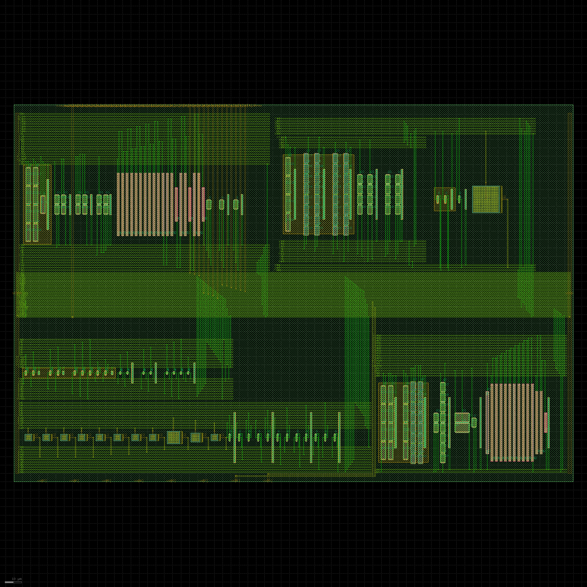

# Self-calibrating charge amplifier

Tiny Tapeout sky130 analog project — a charge amplifier that measures its own
scale, instead of asking you to trust it.



| | |
| --- | --- |
| top module | `tt_um_wzw_qamp` |
| tiles | 2×2 — 334.88 × 225.76 µm |
| analog pins | 2 — `ua[0]` VOUT, `ua[1]` VCM |
| digital pins | 13 in, 0 out |
| supply | 1.8 V `VDPWR` only |

## How it works

A single-ended OTA integrates charge onto a 500 fF feedback cap. Two knobs on
the same summing node let the chip calibrate itself:

- **`qdac`** — a 6-bit split-capacitor DAC drops a *known* charge onto the
  virtual ground, `Q = C_sel · ΔV`. ΔV is selectable, so one array does two
  jobs: a 1.8 V step is the coarse calibration, a ~180 mV step is the fine
  offset trim.
- **`leakdac`** — a subthreshold current source giving 1 nA / 100 pA / 10 pA,
  for emulating sensor leakage.

`qdac` pins the absolute charge scale; `leakdac` then rides on that calibrated
scale to give an absolute current. The output is the whole ramp on `ua[0]` —
there's no on-chip comparator — so the measurement protocol lives in MCU
firmware and can change after tapeout.

See [docs/info.md](docs/info.md) for the pinout and test procedure.

## Status

Physical verification is clean: TT precheck 15/15, magic DRC 0 (full rule set),
KLayout FEOL/BEOL/offgrid 0, netgen LVS matches on every cell and the top.

**Not simulated.** No SPICE, no corners, no Monte Carlo has been run on this
version. The tile is physically correct and electrically unverified — those are
different things.

## Layout

Generated, not hand-drawn: Python generators emit magic TCL for every cell and
the top, so the tile is reproducible from source.

```bash
python3 scripts/tt_precheck_local.py    # structural checks, needs gdstk + pyyaml
```
